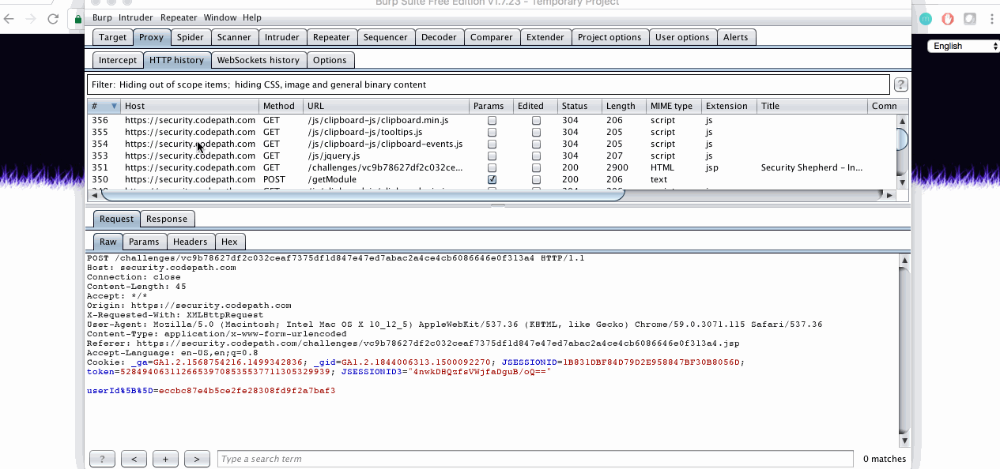

# Cybersecurity Pre-Work - rianna18

Time spent: 3 hours spent in total

## Project Description

This pre-work project uses Burp, a program where your web traffic is sent to. This program is used to complete specific challenges meant to practice discovering vulnerabilities. These challenges give an introduction to two important topics: URL Manipulation and Insecure Direct Object Reference. There are five required and two bonus challenges and hints are provided to help you get started.

## User Stories

The following **required** functionality is completed:

1. [x]  Required: Setup 
    -  [x]  Download and install Burp
    -  [x]  Configure your browser to direct traffic through Burp
    -  [x]  Can successfully view HTTPS traffic in sa
    -  [x]  Register an account at security.shephard.com
  
2. [x]  Required: Challenge 1 - HTTP Headers
3. [x]  Required: Challenge 2 - Basic Routes 1
4. [x]  Required: Challenge 3 - Query Params 1
5. [x]  Required: Challenge 4 - Insecure Direct Object References (IDOR)
6. [x]  Required: Challenge 5 - IDOR Challenge 1 

The following advanced user stories are optional:

* [x]  Bonus 1: IDOR Challenge 2 
* [x]  Bonus 2: IDOR Bank Challenge 3

## Video Walkthrough

Here's a walkthrough of implemented user stories:

GIF created with [LiceCap](http://www.cockos.com/licecap/).

## Notes

I had some trouble understanding how proxies work and getting the web traffic to go thorugh Burp, but I was able to get a hang of it quickly and felt very comfortable with the program after finishing all the challenges.

## Installation Instructions

1. Go to https://portswigger.net/burp/freedownload/ and download file.
2. Once downloaded, configure your Browser to work with Burp using these instructions:               
        https://support.portswigger.net/customer/en/portal/articles/1783055-configuring-your-browser-to-work-with-burp
3. Once Burp is installed and opened, turn off intercept by going to Proxy > Intercept and click the button until it says "Intercept is Off".
4. Install Burp's CA certificate for your browser in order to look throught HTTPS traffic using these instructions:
        https://support.portswigger.net/customer/en/portal/articles/1783075-Installing_Installing%20CA%20Certificate.html
5. Once the certificate is installed, you should be able to see the HTTPS traffic going through Burp.

If you have any problems with installation or any questions about Burp you can go to:
        https://support.portswigger.net/

## License

    Copyright [2017] [Rianna Jawa]

    Licensed under the Apache License, Version 2.0 (the "License");
    you may not use this file except in compliance with the License.
    You may obtain a copy of the License at

        http://www.apache.org/licenses/LICENSE-2.0

    Unless required by applicable law or agreed to in writing, software
    distributed under the License is distributed on an "AS IS" BASIS,
    WITHOUT WARRANTIES OR CONDITIONS OF ANY KIND, either express or implied.
    See the License for the specific language governing permissions and
    limitations under the License.
